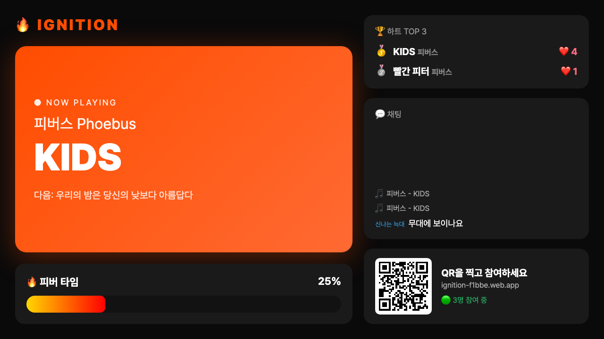
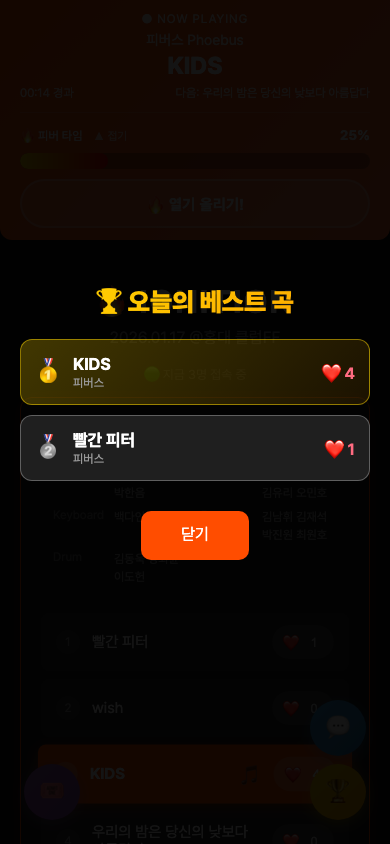

# IGNITION

밴드 공연에 붙여 쓰는 참여형 공연 모듈. 관객은 링크 하나로 접속해 지금 연주 중인 곡을 확인하고, 하트와 채팅으로 무대에 실시간으로 반응하며, 추첨 이벤트에도 참여합니다.

관객이 밴드 공연을 더 즐겁게 관람하기를 바라며 기획했고, 2026년 1월 17일 홍대 클럽FF에서 열린 IGNITION 합동 공연(4개 밴드, 24곡)에서 실제로 사용했습니다. 앱 설치 없이 브라우저로 접속하고, 관리자가 곡을 바꾸면 모든 관객의 화면이 즉시 따라옵니다. 셋리스트 조회, 하트, 채팅, 추첨이 한 화면에 모여 있어 관객이 여러 서비스를 오갈 필요가 없습니다.

배포 주소: https://ignition-f1bbe.web.app

## 화면

| 셋리스트와 Now Playing | 하트 리더보드 | 실시간 채팅 |
|---|---|---|
|  |  |  |

| 추첨 참여 | 피버 타임 MAX | 관리자 컨트롤 |
|---|---|---|
|  |  |  |

무대 화면 모드 (`?screen`, 프로젝터용)



베스트 곡 발표



## 주요 기능

관객 화면

- 지금 연주 중인 곡을 확인한다. 관리자가 곡을 선택하면 모든 관객의 화면 상단에 Now Playing 바가 고정되고, 셋리스트에서 해당 곡이 강조되며 자동으로 스크롤된다. 바에는 다음 곡과 경과 시간이 함께 표시된다.
- 지금 몇 명이 접속해 있는지 본다. 연결이 끊기면 상단에 배너가 뜨고, 복구되면 자동으로 따라잡는다.
- 팀, 팀원(파트별 이름), 셋리스트를 한눈에 본다. 4개 팀, 팀당 6곡.
- 곡마다 하트를 보낸다. 누르는 즉시 숫자가 오르고 플로팅 하트 애니메이션이 뜬다. 횟수 제한은 없다.
- 하트 리더보드로 TOP 10 곡을 본다. 1위부터 3위는 메달로 표시된다.
- 피버 타임 게이지를 채운다. Now Playing 바 아래의 "열기 올리기" 버튼을 연타하면 현재 팀의 게이지가 차오르고, 80%부터 빛나기 시작해 목표에 닿으면 모든 관객 화면에 "MAX!" 폭발 이펙트와 진동이 터지며 채팅에 알림이 올라간다. 목표는 기본적으로 접속자 수에 맞춰 자동으로 정해진다(1명당 5회). 팀당 한 번만 터지고, 게이지는 접어둘 수 있다.
- 실시간 채팅에 참여한다. 기기마다 "붉은 여우" 같은 익명 닉네임이 자동으로 붙어 익명은 지키면서 대화가 된다. 30자 제한, 10초 쿨타임(서버 규칙으로도 강제), 최근 20개 표시, 전체 보기 지원. 곡이 바뀌면 "지금 시작한 곡" 알림이 채팅에 올라오고, 관리자가 고정한 공지는 채팅창 위와 메인 화면에 늘 보인다. 채팅창을 닫아둔 동안 온 메시지는 안 읽은 배지로 표시된다.
- 후원 버튼을 누른다. 실제 결제 없이 채팅에 후원 알림만 올라가는 응원용 기능이다.
- 추첨에 참여한다. 참여하면 001부터 순번을 받고, 같은 기기에서는 한 번만 참여할 수 있다. 관리자가 추첨하면 모든 관객 화면에 당첨 번호가 동시에 뜨고, 내 번호와 대조해 당첨자에게는 축하 화면이 나온다. 경품이 여러 개면 추첨을 반복하며 이미 당첨된 번호는 제외된다.
- 공연 끝에 관리자가 발표하는 "오늘의 베스트 곡" TOP 3를 3위부터 차례로 공개되는 화면으로 본다.

관리자 화면 (`?admin` 파라미터로 로그인 화면 진입, Firebase Authentication 계정으로 로그인)

- 셋리스트에서 곡을 눌러 Now Playing을 바꾼다. 화면 하단 고정 조작바의 "이전", "다음", "되돌리기"로 두 번 탭 만에 진행할 수 있고, 대기 상태와 공연 종료 상태로도 전환할 수 있다.
- 셋리스트(팀, 파트별 멤버, 곡 순서)를 화면에서 편집한다. 저장하면 모든 관객 화면이 즉시 바뀐다. 코드 수정과 재배포 없이 다른 공연에 쓸 수 있다.
- 무대 화면 모드(`?screen`)를 프로젝터에 띄운다. Now Playing, 피버 게이지, 하트 TOP 3, 채팅 흐름, 고정 공지, 접속자 수, 참여용 QR 코드를 큰 글씨로 보여준다.
- 채팅에 고정 공지를 띄우고, 오늘의 베스트 곡 TOP 3를 발표한다.
- 하트, 채팅, 추첨 참여를 한 번에 열거나 닫는다. 기본값은 닫힘이라 공연 시작 전 오작동을 막는다.
- 추첨을 실행하고 참여자를 초기화한다.
- 채팅을 비활성화하거나 채팅창 자체를 숨기고, 특정 메시지를 숨기거나 전체를 삭제한다.
- 피버 타임 자동 목표를 끄고 직접 정하거나, 현재 팀을 강제로 MAX로 만들거나(불지르기) 해제하고(불끄기), 전체 게이지를 초기화한다.
- 하트를 전체 초기화한다. 초기화류 작업은 확인 대화상자를 한 번 더 거친다.
- 로그인은 새로고침해도 유지되고, 패널의 로그아웃 버튼으로 끝낼 수 있다.

## 기술 스택

| 영역 | 선택 | 이유 |
|---|---|---|
| 프론트엔드 | HTML, CSS, 바닐라 JavaScript 단일 파일 | 빌드 없이 공연 당일 수정과 배포를 가장 빠르게 하려고 |
| 실시간 동기화 | Firebase Realtime Database (v8 SDK, CDN) | 서버 없이 전 관객 화면을 동기화하려고 |
| 관리자 인증 | Firebase Authentication (이메일+비밀번호) | 비밀번호를 코드 밖에 두고, 관리자 전용 쓰기를 DB 규칙에서 서버 측으로 강제하려고 |
| 호스팅 | Firebase Hosting | 모든 경로를 `setlist.html`로 rewrite해 링크 하나로 접속 |

## 시작하기

요구사항

- 모던 브라우저 (모바일 기준으로 설계)
- 배포 시에만 Firebase CLI

로컬에서 열기

빌드 단계가 없습니다. `setlist.html`을 브라우저에서 직접 열면 됩니다. Firebase SDK는 CDN에서 불러오므로 `file://`로 열어도 실시간 기능이 동작합니다.

```bash
open setlist.html
```

무대 화면은 주소 뒤에 `?screen`을 붙입니다. 프로젝터나 무대 옆 모니터에서 브라우저 전체 화면으로 띄우면 됩니다.

```
https://ignition-f1bbe.web.app/?screen
```

관리자로 접속하기

주소 뒤에 `?admin`을 붙이면 로그인 입력란이 나타납니다. 관리자 계정은 Firebase Authentication에 있고(`setlist.html`의 `ADMIN_EMAIL`), 비밀번호는 코드 어디에도 없습니다. 비밀번호 변경은 Firebase 콘솔의 Authentication 사용자 목록에서 합니다.

```
https://ignition-f1bbe.web.app/?admin
```

다른 공연에 쓰기

1. `setlist.html`의 `firebaseConfig`를 본인 Firebase 프로젝트 값으로 바꿉니다.
2. `playlist` 배열의 팀, 팀원, 곡 목록을 수정합니다.
3. Firebase 콘솔에서 Authentication의 이메일/비밀번호 로그인을 켜고 관리자 계정을 하나 만든 뒤, `setlist.html`의 `ADMIN_EMAIL`과 `database.rules.json`의 관리자 UID를 그 계정 값으로 바꿉니다.
4. `.firebaserc`의 프로젝트 ID를 바꾸고 배포합니다. 호스팅과 Realtime Database 보안 규칙(`database.rules.json`)이 함께 올라갑니다.

```bash
firebase login
firebase deploy
```

Realtime Database 보안 규칙

관객은 로그인 없이 접속하므로 읽기는 전부 공개입니다. 쓰기는 두 등급으로 나눕니다.

- 관객 쓰기: 하트와 피버 게이지는 기존 값보다 크고 한 번에 100 이하 증가만, 추첨 번호는 1씩 증가만, 추첨 참여와 채팅 메시지는 새 항목 생성만 허용합니다. 채팅은 정해진 필드와 100자 이내로 제한합니다.
- 관리자 쓰기: 곡 변경, 참여 열기/닫기, 채팅 설정, 피버 목표값, 당첨 번호, 그리고 모든 삭제는 Firebase Authentication으로 로그인한 관리자 UID만 할 수 있습니다.

Firebase 콘솔의 테스트 모드 규칙은 일정 기간 뒤 만료되어 앱이 통째로 멈추므로, 규칙 파일을 저장소에 두고 배포와 함께 올립니다.

테스트

배포 주소에 관리자, 관객, 무대 화면 브라우저를 붙여 로그인, 권한 거부, 곡 진행, 하트, 채팅, 추첨, 피버 타임, 베스트 곡, 셋리스트 편집, 초기화까지 한 번에 검증합니다. 실제 DB에 테스트 데이터를 썼다가 지우므로 공연 중에는 돌리지 않습니다.

```bash
python3 -m pip install playwright && python3 -m playwright install chromium
ADMIN_PASSWORD='관리자 비밀번호' python3 tests/e2e.py
```

공연 리포트

공연이 끝나면 Firebase CLI로 DB를 백업하고 리포트를 만듭니다. 백업 JSON에는 채팅 원문이 들어 있으니 저장소에 올리지 않습니다(`backup/`은 gitignore 대상).

```bash
firebase database:get / --pretty -o backup/2026-01-17-ignition-db.json
python3 tools/report.py backup/2026-01-17-ignition-db.json > docs/report-2026-01-17.md
```

## 프로젝트 구조

```
IGNITION/
├── setlist.html            관객 화면, 관리자 화면, 무대 화면의 마크업
├── style.css               스타일
├── app.js                  Firebase 연동과 모든 기능 로직
├── firebase.json           Hosting과 Database 규칙 배포 설정. 모든 경로를 setlist.html로 rewrite
├── database.rules.json     Realtime Database 보안 규칙
├── .firebaserc             Firebase 프로젝트 ID
├── tools/report.py         DB 백업 JSON으로 공연 리포트(Markdown)를 만드는 스크립트
├── tests/e2e.py            배포 주소에 관리자와 관객 브라우저를 붙여 전 기능을 검증하는 Playwright 테스트
└── docs/
    ├── screenshots/        README용 화면 캡처
    └── report-2026-01-17.md  1월 공연 리포트 (집계만, 채팅 원문 없음)
```

빌드 도구는 없습니다. 세 파일을 그대로 호스팅합니다.

Realtime Database 경로

| 경로 | 내용 |
|---|---|
| `liveStatus` | 현재 팀과 곡, 갱신 시각 |
| `setlist` | 셋리스트 (없으면 코드의 기본값 사용) |
| `presence/{clientId}` | 접속 중인 기기. 연결이 끊기면 서버가 지운다 |
| `hearts/{songId}` | 곡별 하트 수. songId는 팀명과 곡명을 base64로 만든 키 |
| `hypeCount/{팀명}` | 팀별 피버 타임 게이지 |
| `hypeExplodedTeams/{팀명}` | 팀별 MAX 달성 여부 |
| `hypeAuto`, `hypeTarget` | 자동 목표 여부와 수동 목표값 |
| `pinnedNotice` | 고정 공지 |
| `chatRate/{chatId}` | 기기별 마지막 채팅 시각 (서버 측 10초 제한용) |
| `announcement` | 베스트 곡 발표 |
| `raffle/nextNumber` | 다음 발급 번호 |
| `raffle/participants/{번호}` | 참여자 목록 |
| `raffle/winner` | 최근 당첨 번호 |
| `raffle/drawn/{번호}` | 이미 당첨된 번호 (반복 추첨 시 제외) |
| `chat` | 채팅 메시지. 일반, 곡 변경 알림, 후원 알림 |
| `chatEnabled`, `chatVisible` | 채팅 활성화, 채팅창 표시 여부 |
| `interactionEnabled` | 관객 참여 기능 일괄 열림 여부 |

## 설계 결정

빌드 없는 단일 HTML 파일

공연 당일에 문구를 고치고 기능을 빼는 일이 실제로 다섯 번 있었습니다. 빌드 파이프라인이 있었다면 그때마다 빌드를 돌리고 결과물을 확인해야 했을 것입니다. 파일 하나를 고쳐 바로 배포하는 구조가 현장에서는 가장 안전했습니다.

Firebase Realtime Database로 서버 없는 동기화

곡 전환, 하트, 채팅, 추첨 결과가 모두 데이터베이스 경로 하나를 구독하는 방식으로 전파됩니다. 별도 서버나 소켓 코드 없이 `on('value')` 리스너만으로 전 관객 화면이 같은 상태를 유지합니다.

하트 디바운싱과 transaction

관객이 하트를 연타하면 로컬 카운트를 즉시 올려 반응성을 확보하고, 500ms 동안 모은 횟수를 `transaction`으로 한 번에 더합니다. 수백 명이 동시에 눌러도 쓰기 요청이 폭주하지 않고, 서버 값이 로컬보다 클 때만 덮어쓰기 때문에 다른 관객의 하트가 반영되는 순간 숫자가 뒤로 튀지 않습니다.

관객 참여 일괄 열기/닫기

하트, 채팅, 추첨은 기본값이 닫힘입니다. 리허설이나 입장 중에 관객이 먼저 눌러 데이터가 쌓이는 일을 막고, 관리자가 공연 시작 시점에 한 번에 엽니다.

피버 타임의 복원과 수정

피버 타임은 공연 당일 버그와 성능 문제로 관객 쪽 버튼만 떼어낸 채 공연을 치렀고, 공연 뒤 원인을 짚어 고쳐서 되살렸습니다.

- 목표 도달 순간 접속자 전원이 각자 MAX 기록과 채팅 알림을 쓰던 것을, `hypeExplodedTeams/{팀명}`에 transaction을 걸어 한 클라이언트만 기록과 알림을 남기도록 바꿨습니다. 관객 수만큼 알림이 도배되던 문제가 사라집니다.
- 화면 전체에 5분간 이어지던 box-shadow 애니메이션을 4초짜리 페이드 오버레이로 줄였습니다. 모바일에서 셋리스트 스크롤이 버벅이던 원인이었습니다.
- 게이지가 들어가면 상단 고정 바가 커지는데 본문 여백은 100px로 고정되어 있어 셋리스트 상단이 가려졌습니다. 바의 실제 높이를 측정해 여백을 맞추고, 게이지를 접고 펼칠 때도 다시 계산합니다.
- 코드의 기본 목표값(20)과 관리자 화면 표시(300)가 달랐던 것을 300으로 통일했습니다.
- 늦게 접속한 관객에게 이미 끝난 팀의 폭발 이펙트가 재생되지 않도록, 첫 스냅샷에서는 이펙트를 건너뜁니다.

접속자 수와 자동 목표

Firebase의 `.info/connected`와 `onDisconnect`로 기기마다 `presence` 항목을 남기고 끊기면 서버가 지웁니다. 이 수가 헤더와 무대 화면에 보이고, 피버 타임 목표는 접속자 1명당 5회로 자동 계산됩니다. 1월 공연 때는 목표가 20으로 배포되어 곧바로 터졌는데, 관객 수에 따라 목표를 맞추면 30명이든 300명이든 비슷한 노력으로 MAX에 닿습니다.

서버 측 채팅 속도 제한

10초 쿨타임은 원래 브라우저에만 있어서 개발자 도구로 우회할 수 있었습니다. 메시지를 쓰기 전에 `chatRate/{chatId}`에 서버 시각 도장을 찍게 하고, 규칙에서 10초 안의 재도장을 거부하며 도장이 5초 안에 찍힌 메시지만 받습니다. 곡 변경 알림은 로그인한 관리자만 쓸 수 있습니다.

무대 화면

같은 `app.js`가 `?screen`이면 관객 UI를 숨기고 무대용 레이아웃을 그립니다. 새 데이터 구조 없이 이미 구독 중인 하트, 채팅, 피버, 접속자 리스너가 화면 갱신 함수를 한 번 더 부르는 구조라, 관객이 폰에서 하는 모든 참여가 그대로 무대에 비칩니다.

추첨 번호 발급

`raffle/nextNumber`를 transaction으로 증가시켜 번호가 겹치지 않게 하고, 발급받은 번호는 localStorage에 저장해 같은 기기에서 다시 참여하지 못하게 합니다.

관리자 인증

처음에는 비밀번호를 소스에 두고 브라우저에서 비교했습니다. 서버가 없는 정적 페이지라 시크릿 매니저를 써도 결국 브라우저가 값을 받아야 하므로 숨길 수 없고, 개발자 도구로 `isAdmin`만 바꾸면 관리자 행동이 가능했습니다. 그래서 Firebase Authentication으로 옮겼습니다. 비밀번호는 Firebase가 보관하고, 관리자 전용 경로는 DB 규칙이 로그인한 UID를 서버 측에서 확인합니다. 브라우저에서 `isAdmin`을 바꿔도 곡 변경이나 삭제는 규칙에서 거부됩니다. 소스에 남는 것은 관리자 이메일과 UID뿐이고, 둘 다 비밀이 아닙니다.

## 배우고 느낀 점

개발 자체는 계획한 대로 구현되어 어렵지 않았습니다. 정작 문제는 공연장에서 링크를 나눠주는 단계에서 터졌습니다. 관객 다수가 아이폰이었는데, 웹 발신 문자로 보낸 링크는 아이폰에서 터치가 되지 않았습니다. 결국 관객이 주소를 직접 타이핑해서 들어오는 상황이 벌어졌습니다.

제품이 아무리 잘 돌아가도 관객 손에 닿는 마지막 경로가 막히면 아무 소용이 없다는 것을 현장에서 배웠습니다. 다음 공연에서는 카카오톡 플러스 채널을 만들어 링크를 배포할 계획입니다. 진입 경로는 기능과 같은 무게로 미리 테스트해야 합니다.
