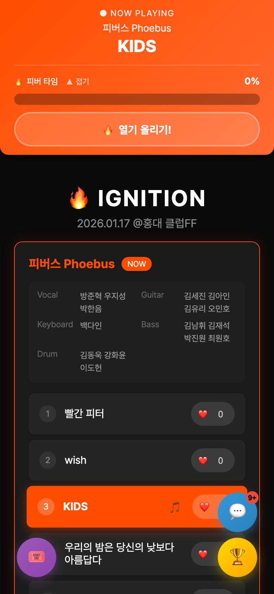
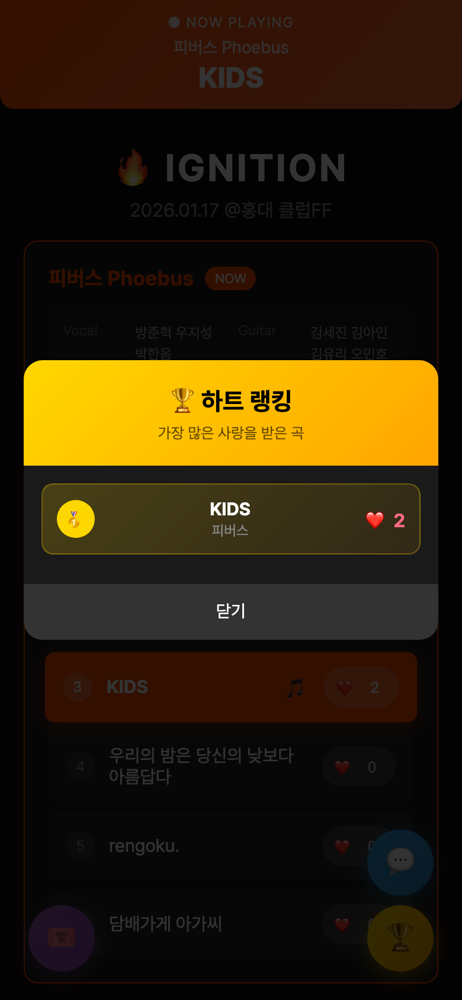
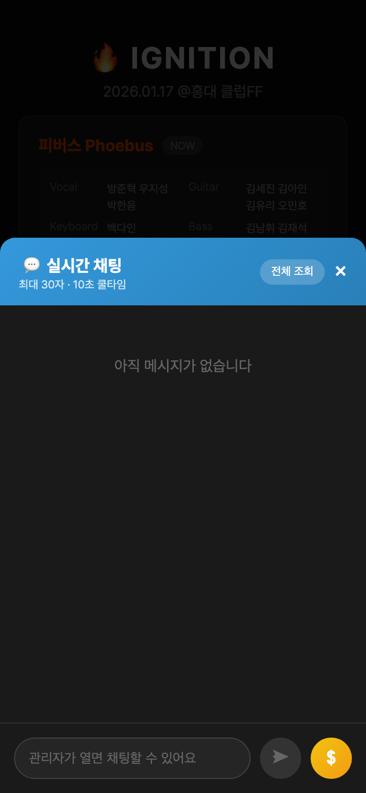
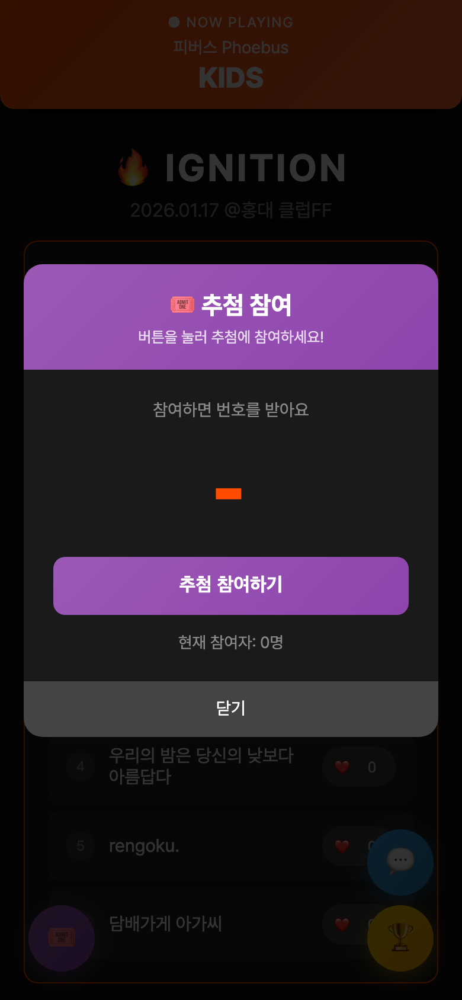
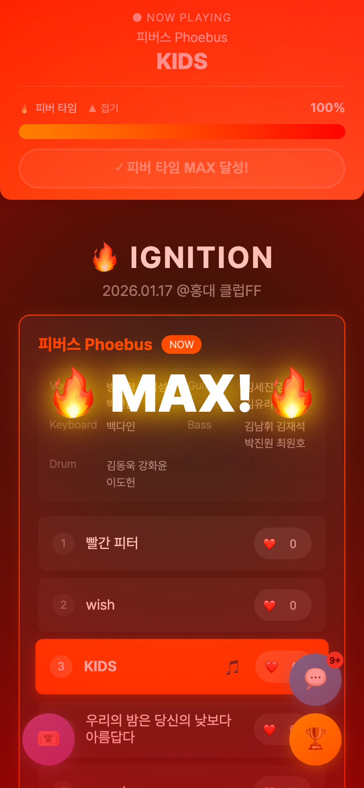
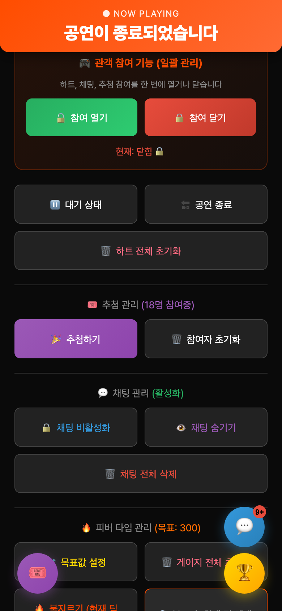

# IGNITION

밴드 공연에 붙여 쓰는 참여형 공연 모듈. 관객은 링크 하나로 접속해 지금 연주 중인 곡을 확인하고, 하트와 채팅으로 무대에 실시간으로 반응하며, 추첨 이벤트에도 참여합니다.

관객이 밴드 공연을 더 즐겁게 관람하기를 바라며 기획했고, 2026년 1월 17일 홍대 클럽FF에서 열린 IGNITION 합동 공연(4개 밴드, 24곡)에서 실제로 사용했습니다. 앱 설치 없이 브라우저로 접속하고, 관리자가 곡을 바꾸면 모든 관객의 화면이 즉시 따라옵니다. 셋리스트 조회, 하트, 채팅, 추첨이 한 화면에 모여 있어 관객이 여러 서비스를 오갈 필요가 없습니다.

배포 주소: https://ignition-f1bbe.web.app

## 화면

| 셋리스트와 Now Playing | 하트 리더보드 | 실시간 채팅 |
|---|---|---|
|  |  |  |

| 추첨 참여 | 피버 타임 MAX | 관리자 컨트롤 |
|---|---|---|
|  |  |  |

## 주요 기능

관객 화면

- 지금 연주 중인 곡을 확인한다. 관리자가 곡을 선택하면 모든 관객의 화면 상단에 Now Playing 바가 고정되고, 셋리스트에서 해당 곡이 강조되며 자동으로 스크롤된다.
- 팀, 팀원(파트별 이름), 셋리스트를 한눈에 본다. 4개 팀, 팀당 6곡.
- 곡마다 하트를 보낸다. 누르는 즉시 숫자가 오르고 플로팅 하트 애니메이션이 뜬다. 횟수 제한은 없다.
- 하트 리더보드로 TOP 10 곡을 본다. 1위부터 3위는 메달로 표시된다.
- 피버 타임 게이지를 채운다. Now Playing 바 아래의 "열기 올리기" 버튼을 연타하면 현재 팀의 게이지가 차오르고, 80%부터 빛나기 시작해 목표(기본 300)에 닿으면 모든 관객 화면에 "MAX!" 폭발 이펙트가 터지며 채팅에 알림이 올라간다. 팀당 한 번만 터진다. 게이지는 접어둘 수 있다.
- 실시간 채팅에 참여한다. 30자 제한, 10초 쿨타임, 최근 20개 표시, 전체 보기 지원. 곡이 바뀌면 "지금 시작한 곡" 시스템 알림이 채팅에 올라오고, 채팅창을 닫아둔 동안 온 메시지는 안 읽은 배지로 표시된다.
- 후원 버튼을 누른다. 실제 결제 없이 채팅에 후원 알림만 올라가는 응원용 기능이다.
- 추첨에 참여한다. 참여하면 001부터 순번을 받고, 같은 기기에서는 한 번만 참여할 수 있다. 관리자가 추첨하면 모든 관객 화면에 당첨 번호가 동시에 뜨고, 내 번호와 대조해 당첨자에게는 축하 화면이 나온다.

관리자 화면 (`?admin` 파라미터와 비밀번호로 진입)

- 셋리스트에서 곡을 눌러 Now Playing을 바꾼다. 대기 상태, 공연 종료 상태로도 전환할 수 있다.
- 하트, 채팅, 추첨 참여를 한 번에 열거나 닫는다. 기본값은 닫힘이라 공연 시작 전 오작동을 막는다.
- 추첨을 실행하고 참여자를 초기화한다.
- 채팅을 비활성화하거나 채팅창 자체를 숨기고, 특정 메시지를 숨기거나 전체를 삭제한다.
- 피버 타임 목표값을 바꾸고, 현재 팀을 강제로 MAX로 만들거나(불지르기) 해제하고(불끄기), 전체 게이지를 초기화한다.
- 하트를 전체 초기화한다. 초기화류 작업은 별도 비밀번호를 한 번 더 요구한다.

## 기술 스택

| 영역 | 선택 | 이유 |
|---|---|---|
| 프론트엔드 | HTML, CSS, 바닐라 JavaScript 단일 파일 | 빌드 없이 공연 당일 수정과 배포를 가장 빠르게 하려고 |
| 실시간 동기화 | Firebase Realtime Database (v8 SDK, CDN) | 서버 없이 전 관객 화면을 동기화하려고 |
| 호스팅 | Firebase Hosting | 모든 경로를 `setlist.html`로 rewrite해 링크 하나로 접속 |

## 시작하기

요구사항

- 모던 브라우저 (모바일 기준으로 설계)
- 배포 시에만 Firebase CLI

로컬에서 열기

빌드 단계가 없습니다. `setlist.html`을 브라우저에서 직접 열면 됩니다. Firebase SDK는 CDN에서 불러오므로 `file://`로 열어도 실시간 기능이 동작합니다.

```bash
open setlist.html
```

관리자로 접속하기

주소 뒤에 `?admin`을 붙이면 비밀번호 입력란이 나타납니다. 관리자 비밀번호와 초기화 비밀번호는 `setlist.html`에 SHA-256 해시(`ADMIN_PASSWORD_HASH`, `RESET_PASSWORD_HASH`)로만 들어 있습니다. 비밀번호를 바꾸려면 터미널에서 해시를 만들어 상수를 교체합니다.

```bash
printf '새비밀번호' | shasum -a 256
```

```
https://ignition-f1bbe.web.app/?admin
```

다른 공연에 쓰기

1. `setlist.html`의 `firebaseConfig`를 본인 Firebase 프로젝트 값으로 바꿉니다.
2. `playlist` 배열의 팀, 팀원, 곡 목록을 수정합니다.
3. `ADMIN_PASSWORD_HASH`와 `RESET_PASSWORD_HASH`를 새 해시로 바꿉니다.
4. `.firebaserc`의 프로젝트 ID를 바꾸고 배포합니다. 호스팅과 Realtime Database 보안 규칙(`database.rules.json`)이 함께 올라갑니다.

```bash
firebase login
firebase deploy
```

Realtime Database 보안 규칙

관객은 로그인 없이 접속하므로 규칙은 모든 경로를 공개 읽기로 두고, 앱이 쓰는 경로만 공개 쓰기로 엽니다. 대신 각 경로에 데이터 형태 검증을 걸어 두었습니다. 채팅 메시지는 정해진 필드만, 하트는 0 이상의 숫자만, 상태 플래그는 불리언만 허용합니다. Firebase 콘솔의 테스트 모드 규칙은 일정 기간 뒤 만료되어 앱이 통째로 멈추므로, 규칙 파일을 저장소에 두고 배포와 함께 올립니다.

## 프로젝트 구조

```
IGNITION/
├── setlist.html          관객 화면, 관리자 화면, 스타일, 로직이 모두 든 단일 파일
├── firebase.json         Hosting과 Database 규칙 배포 설정. 모든 경로를 setlist.html로 rewrite
├── database.rules.json   Realtime Database 보안 규칙
├── .firebaserc           Firebase 프로젝트 ID
└── docs/screenshots/     README용 화면 캡처
```

Realtime Database 경로

| 경로 | 내용 |
|---|---|
| `liveStatus` | 현재 팀과 곡, 갱신 시각 |
| `hearts/{songId}` | 곡별 하트 수. songId는 팀명과 곡명을 base64로 만든 키 |
| `hypeCount/{팀명}` | 팀별 피버 타임 게이지 |
| `hypeExplodedTeams/{팀명}` | 팀별 MAX 달성 여부 |
| `hypeTarget` | 피버 타임 목표값 (없으면 300) |
| `raffle/nextNumber` | 다음 발급 번호 |
| `raffle/participants/{번호}` | 참여자 목록 |
| `raffle/winner` | 당첨 번호 |
| `chat` | 채팅 메시지. 일반, 곡 변경 알림, 후원 알림 |
| `chatEnabled`, `chatVisible` | 채팅 활성화, 채팅창 표시 여부 |
| `interactionEnabled` | 관객 참여 기능 일괄 열림 여부 |

## 설계 결정

빌드 없는 단일 HTML 파일

공연 당일에 문구를 고치고 기능을 빼는 일이 실제로 다섯 번 있었습니다. 빌드 파이프라인이 있었다면 그때마다 빌드를 돌리고 결과물을 확인해야 했을 것입니다. 파일 하나를 고쳐 바로 배포하는 구조가 현장에서는 가장 안전했습니다.

Firebase Realtime Database로 서버 없는 동기화

곡 전환, 하트, 채팅, 추첨 결과가 모두 데이터베이스 경로 하나를 구독하는 방식으로 전파됩니다. 별도 서버나 소켓 코드 없이 `on('value')` 리스너만으로 전 관객 화면이 같은 상태를 유지합니다.

하트 디바운싱과 transaction

관객이 하트를 연타하면 로컬 카운트를 즉시 올려 반응성을 확보하고, 500ms 동안 모은 횟수를 `transaction`으로 한 번에 더합니다. 수백 명이 동시에 눌러도 쓰기 요청이 폭주하지 않고, 서버 값이 로컬보다 클 때만 덮어쓰기 때문에 다른 관객의 하트가 반영되는 순간 숫자가 뒤로 튀지 않습니다.

관객 참여 일괄 열기/닫기

하트, 채팅, 추첨은 기본값이 닫힘입니다. 리허설이나 입장 중에 관객이 먼저 눌러 데이터가 쌓이는 일을 막고, 관리자가 공연 시작 시점에 한 번에 엽니다.

피버 타임의 복원과 수정

피버 타임은 공연 당일 버그와 성능 문제로 관객 쪽 버튼만 떼어낸 채 공연을 치렀고, 공연 뒤 원인을 짚어 고쳐서 되살렸습니다.

- 목표 도달 순간 접속자 전원이 각자 MAX 기록과 채팅 알림을 쓰던 것을, `hypeExplodedTeams/{팀명}`에 transaction을 걸어 한 클라이언트만 기록과 알림을 남기도록 바꿨습니다. 관객 수만큼 알림이 도배되던 문제가 사라집니다.
- 화면 전체에 5분간 이어지던 box-shadow 애니메이션을 4초짜리 페이드 오버레이로 줄였습니다. 모바일에서 셋리스트 스크롤이 버벅이던 원인이었습니다.
- 게이지가 들어가면 상단 고정 바가 커지는데 본문 여백은 100px로 고정되어 있어 셋리스트 상단이 가려졌습니다. 바의 실제 높이를 측정해 여백을 맞추고, 게이지를 접고 펼칠 때도 다시 계산합니다.
- 코드의 기본 목표값(20)과 관리자 화면 표시(300)가 달랐던 것을 300으로 통일했습니다.
- 늦게 접속한 관객에게 이미 끝난 팀의 폭발 이펙트가 재생되지 않도록, 첫 스냅샷에서는 이펙트를 건너뜁니다.

추첨 번호 발급

`raffle/nextNumber`를 transaction으로 증가시켜 번호가 겹치지 않게 하고, 발급받은 번호는 localStorage에 저장해 같은 기기에서 다시 참여하지 못하게 합니다.

관리자 인증의 한계

정적 페이지라 서버 측 인증이 없습니다. 비밀번호는 해시로만 보관해 소스를 열어봐도 평문이 드러나지 않게 했지만, 검증 자체는 브라우저에서 이루어지고 데이터베이스 쓰기 권한도 관객과 같습니다. 하루짜리 단발성 공연에서는 이 수준으로 충분하다고 판단했고, 더 큰 행사라면 Firebase Authentication과 관리자 전용 쓰기 규칙이 필요합니다.

## 배우고 느낀 점

개발 자체는 계획한 대로 구현되어 어렵지 않았습니다. 정작 문제는 공연장에서 링크를 나눠주는 단계에서 터졌습니다. 관객 다수가 아이폰이었는데, 웹 발신 문자로 보낸 링크는 아이폰에서 터치가 되지 않았습니다. 결국 관객이 주소를 직접 타이핑해서 들어오는 상황이 벌어졌습니다.

제품이 아무리 잘 돌아가도 관객 손에 닿는 마지막 경로가 막히면 아무 소용이 없다는 것을 현장에서 배웠습니다. 다음 공연에서는 카카오톡 플러스 채널을 만들어 링크를 배포할 계획입니다. 진입 경로는 기능과 같은 무게로 미리 테스트해야 합니다.
